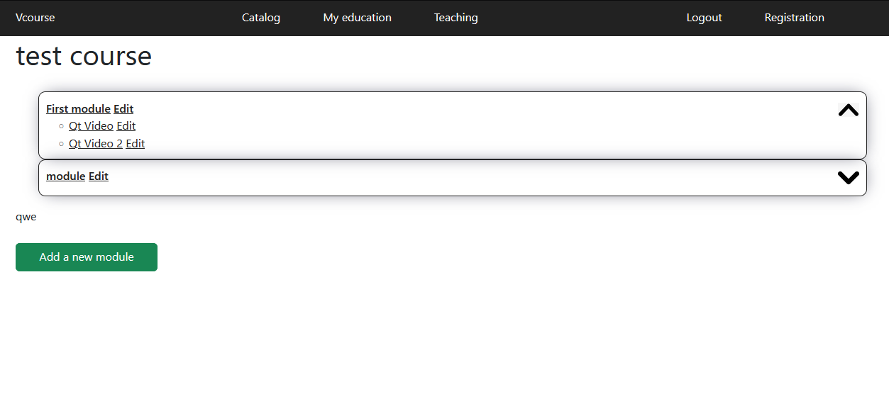
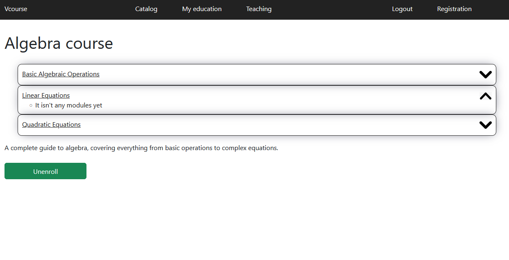
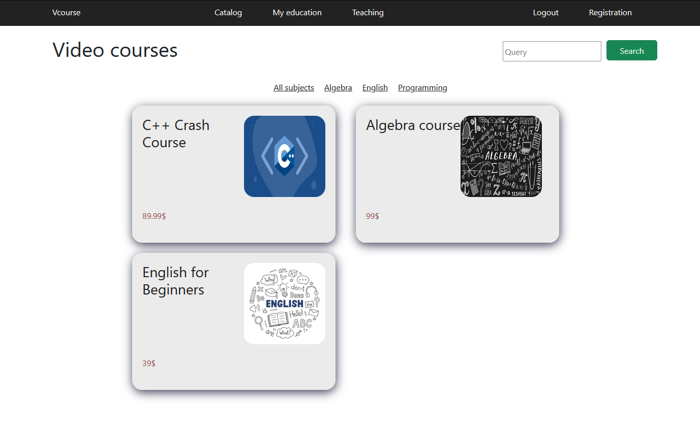
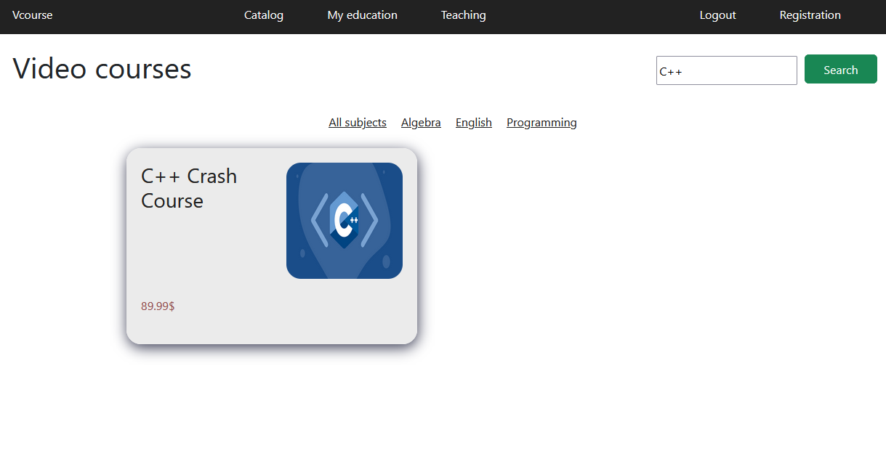
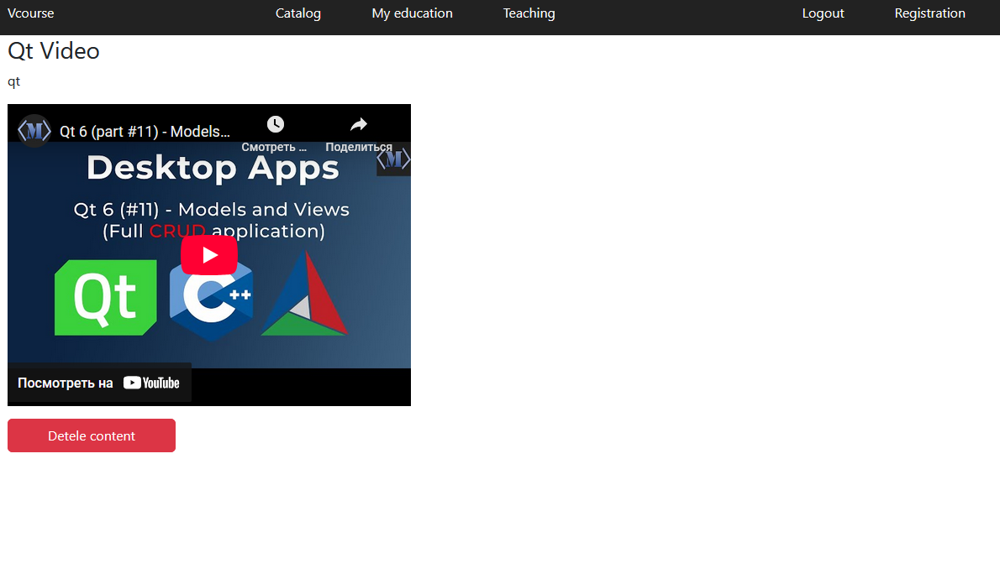

# 📚 Course Management Platform 🎓

Welcome to the **Course Management Platform**, a Django-based application designed to manage courses, modules, and content for instructors and students. It offers a video player for course content and allows instructors to create, update, and manage their courses, while students can join and interact with them. 🎥💻

---

## 🛠️ Features
- **Course Creation & Management**: Instructors can create, edit, and delete courses.

- **Course Modules**: Each course can have multiple modules with descriptive content.

- **Content Management**: Instructors can upload video content to each module.

- **Search & Filter**: Users can search for courses based on title, description, or subject.

- **User Roles**: Only instructors or superusers can manage courses and content.
- **PostgreSQL Database**: Utilizes PostgreSQL for database management.
- **Video Player**: Instructors can upload video links for modules, with a built-in player for easy viewing.

---

## ⚙️ Setup and Installation

Follow these steps to get your environment up and running:

### 1. Create a virtual environment

```bash
python -m venv venv
```

### 2. Activate the virtual environment

#### On Windows:
```bash
venv\Scripts\activate
```

#### On Mac/Linux:
```bash
source venv/bin/activate
```

### 3. Install dependencies

```bash
pip install -r requirements.txt
```

### 4. Set up PostgreSQL database
Make sure you have PostgreSQL installed on your machine. Create a new database and update the `DATABASES` settings in `settings.py` with your PostgreSQL credentials.

### 5. Apply migrations

```bash
python manage.py migrate
```

### 6. Create a superuser (optional)

To access the admin panel, create a superuser:

```bash
python manage.py createsuperuser
```

### 7. Run the development server

```bash
python manage.py runserver
```

Now you can visit the app at: [http://127.0.0.1:8000](http://127.0.0.1:8000)

## 🧑‍🏫 Role Management

- **Instructor**: Create and manage courses, modules, and content (must be part of the "Instructors" group or a superuser).
- **Student**: Join courses, view modules, and interact with content.

---

## 🔧 Technologies Used

- **Django**: Web framework
- **PostgreSQL**: Database management
- **HTML, CSS, JavaScript**: Frontend

